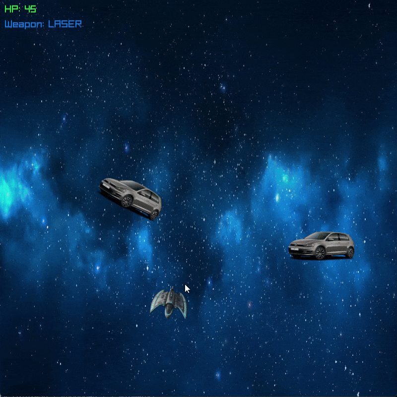

# obiektowka_labs
**Laboratory 1 – Object-Oriented Programming and Computer Graphics**

## My Modifications

### Changed Textures
- Ship
- Background
- Obstacles

### Obstacles Rotation
- Obstacles now rotate around their own axis.

### New Weapon
- Added a new weapon: **ROCKET**

### Enhanced Ship Movement
- The plane slightly tilts when moving in a specific direction.

